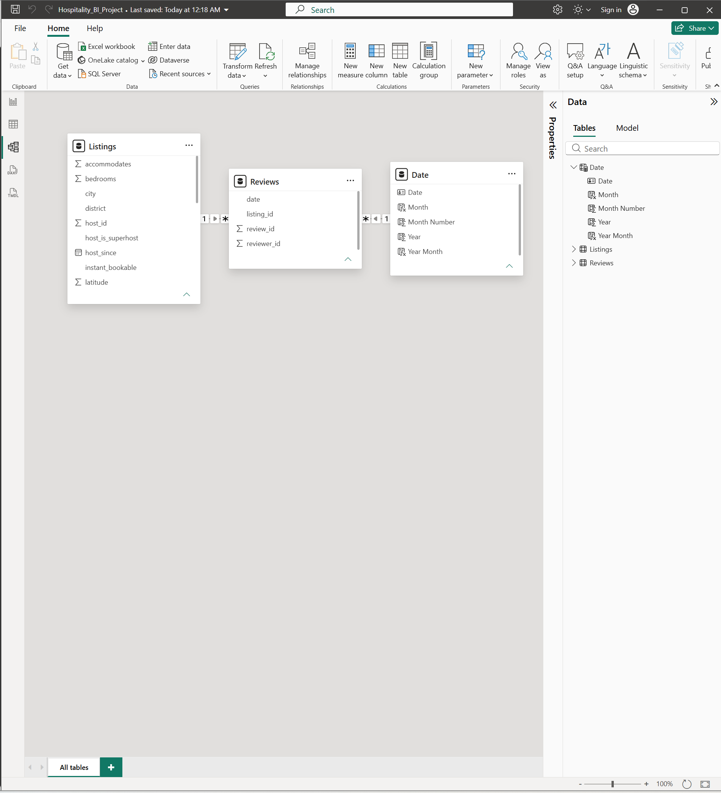
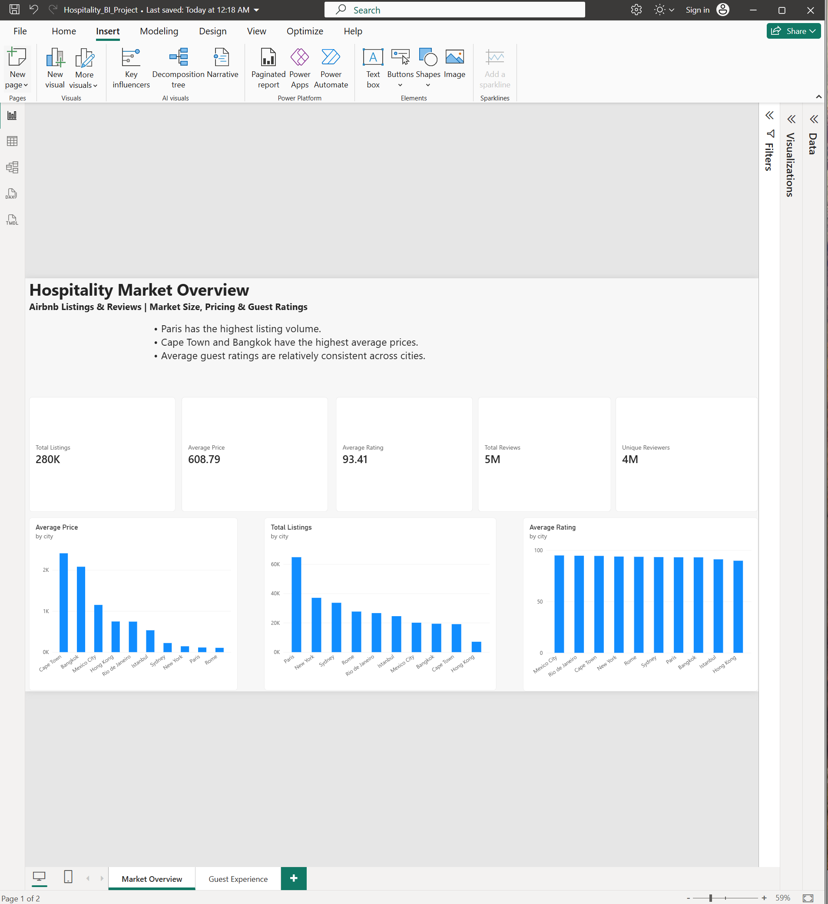
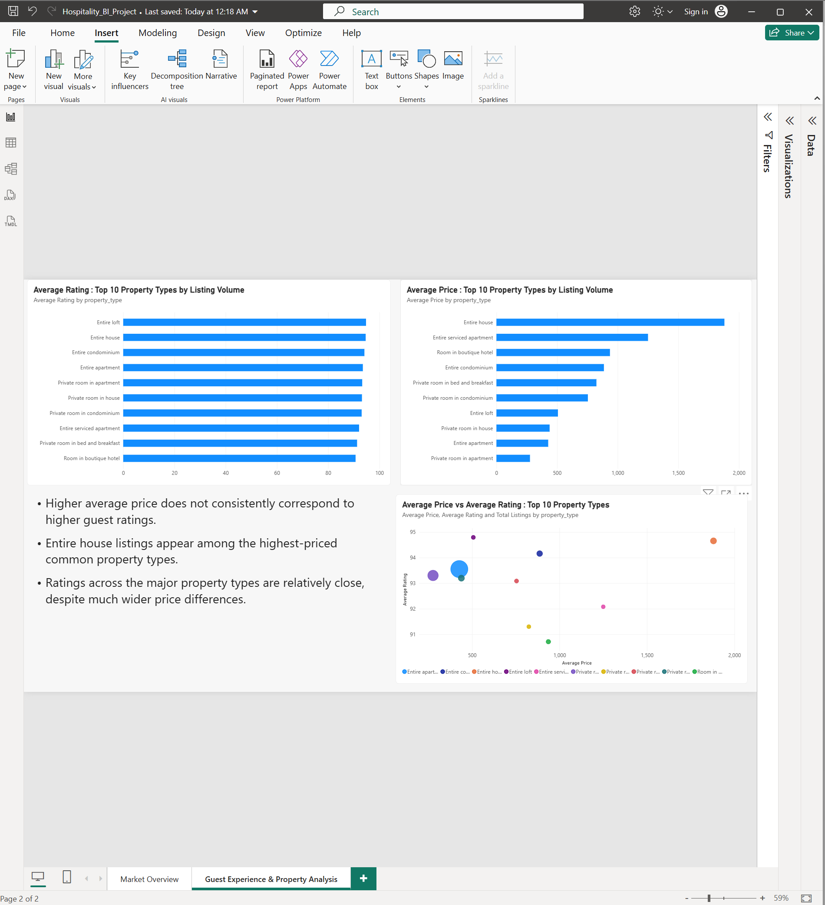
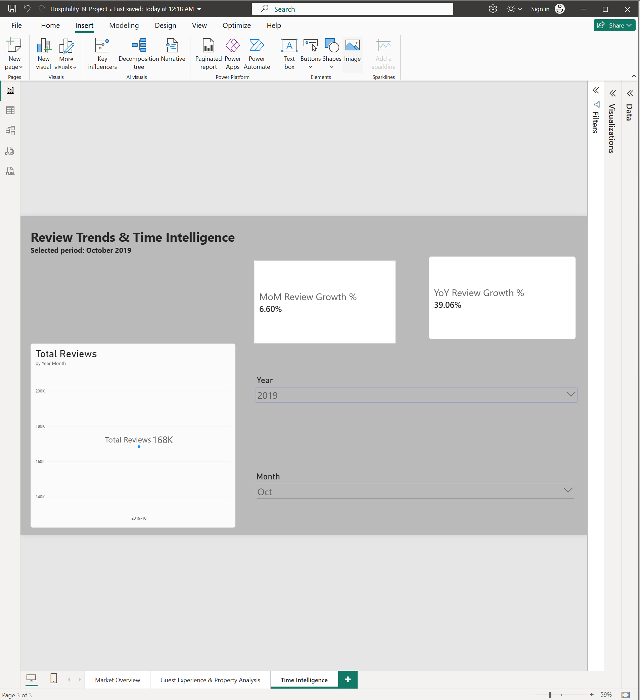

# Hospitality Market Analysis in Power BI

## Project Overview
This project analyzes Airbnb listings and review data across multiple cities to identify pricing patterns, listing volume, guest ratings, and review trends.

The goal was to build a business-focused Power BI dashboard that connects data modelling, DAX calculations, and visual analysis to support decision-making.

## Business Questions
- Which cities have the highest listing volume?
- Which cities have the highest average prices?
- How do guest ratings compare across markets?
- Which major property types are priced highest?
- Do higher-priced property types receive better guest ratings?
- How are reviews changing month over month and year over year?

## Data Model

The model contains three main tables:

- Listings
- Reviews
- Date

Relationships:
- Listings[listing_id] → Reviews[listing_id]
- Date[Date] → Reviews[date]



## Dashboard Pages

### 1. Market Overview

This page summarizes:
- Total Listings
- Average Price
- Average Rating
- Total Reviews
- Unique Reviewers
- Average Price by City
- Listings by City
- Average Rating by City



### 2. Guest Experience & Property Analysis

This page compares the most common property types using:
- Average Rating
- Average Price
- Listing Volume
- Price vs Rating analysis

Key insight:

- Higher average price does not consistently correspond to higher guest ratings.



### 3. Review Trends & Time Intelligence

This page uses a dedicated Date table and DAX time-intelligence measures to analyze review growth.

For the selected period October 2019:
- MoM Review Growth: 6.60%
- YoY Review Growth: 39.06%



## Data Preparation

Power Query was used to prepare the data before analysis.

Key steps included:
- Importing the Listings and Reviews CSV files
- Setting appropriate data types
- Removing unnecessary columns
- Keeping business-relevant fields
- Preparing the data model for analysis
- Creating relationships between Listings, Reviews, and the Date table

## DAX Measures

Key measures created in this project include:

```DAX
Total Listings =
DISTINCTCOUNT(Listings[listing_id])


Average Price =
AVERAGE(Listings[price])


Total Reviews =
COUNTROWS(Reviews)

Unique Reviewers =
DISTINCTCOUNT(Reviews[reviewer_id])

Previous Month Reviews =
CALCULATE(
    [Total Reviews],
    DATEADD('Date'[Date], -1, MONTH)
)

MoM Review Growth % =
DIVIDE(
    [Total Reviews] - [Previous Month Reviews],
    [Previous Month Reviews]
)

Previous Year Reviews =
CALCULATE(
    [Total Reviews],
    SAMEPERIODLASTYEAR('Date'[Date])
)

YoY Review Growth % =
DIVIDE(
    [Total Reviews] - [Previous Year Reviews],
    [Previous Year Reviews]
)

Key Insights
- Paris has the highest listing volume in the dataset.
- Cape Town and Bangkok show some of the highest average prices.
- Guest ratings remain relatively consistent across cities.
- Property types show much wider differences in price than in guest ratings.
- Higher average price does not consistently correspond to higher guest ratings.
- For October 2019, review activity increased 6.60% month over month and 39.06% year over year.

## Skills Demonstrated

- Power BI
- Power Query
- DAX
- Data modelling
- Table relationships
- Time intelligence
- KPI design
- Top N analysis
- Business analysis
- Data visualization
- Insight generation
